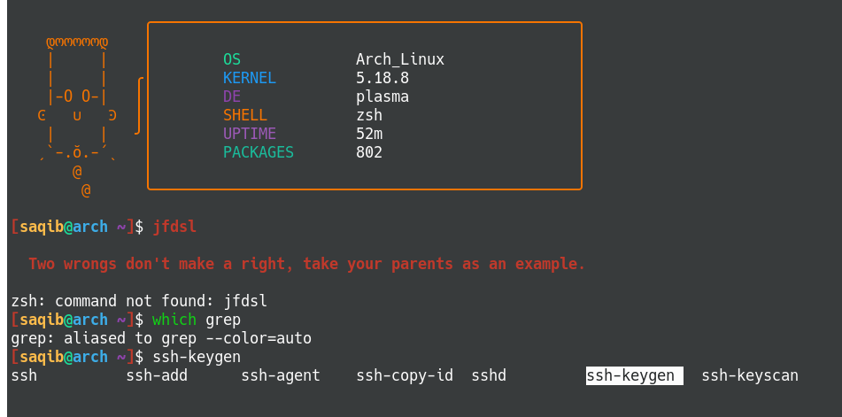

# zoomershell
Script that install zsh, its plugins and deploys my configs for it
Note: This script is only for arch and arch derivative distros

# Features:
- zsh is default shell
- colorful prompt
- auto-tab completion 
- syntax highlighting
- different cursor shapes for insert and normal mode
- vim mode
- useful aliases (local/shell/aliasrc)
- ascii art every time you bring up terminnal
- insults when invalid command id typed

# Example:


# Installation:

```
git clone https://github.com/saqibmir1/zoomershell.git
cd zoomershell
chmod +x zoomershell.sh
./zoomershell
```

Enjoy!
